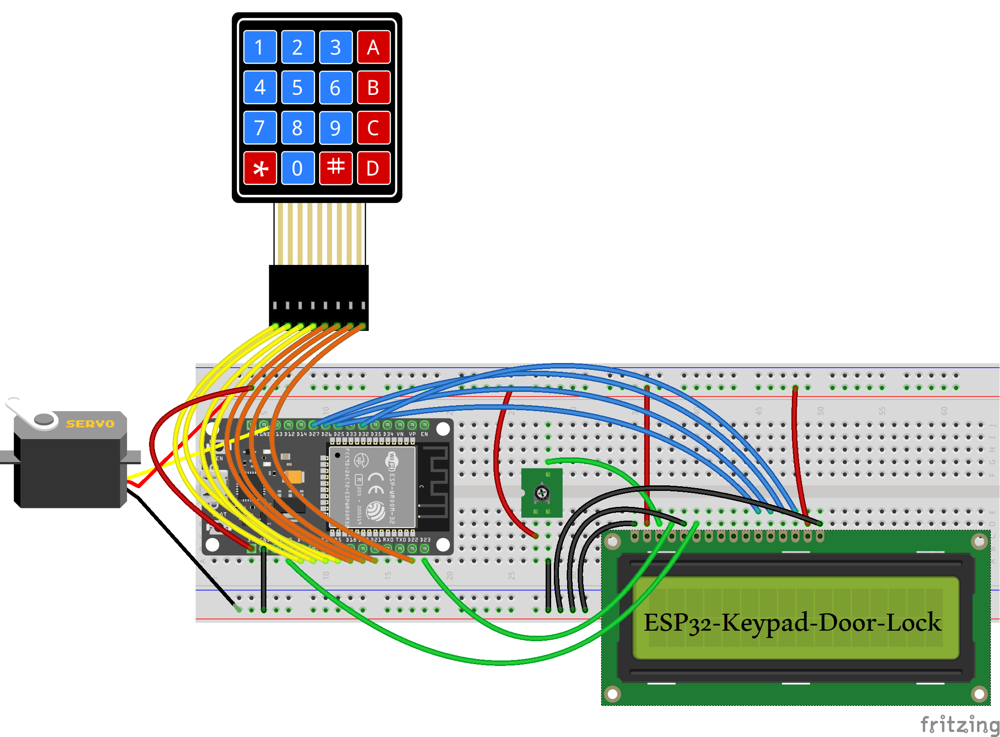

# ESP32 Keypad Door Lock

A password-based electronic door lock system using an ESP32, 4x4 keypad, LCD, and SG90 servo motor.

## Project Overview

This project implements a simple password-based door lock using an ESP32.

The user enters a password through a 4x4 keypad. The entered password is checked by the ESP32 and the result is displayed on an LCD. If the password is correct, an SG90 servo motor rotates to unlock the door. An incorrect password keeps the lock secured.

## Features

- 🔐 Password-based access control
- 🔢 4x4 matrix keypad
- 📟 LCD status display
- ⚙️ SG90 servo motor for locking/unlocking
- 🔒 Password verification
- 🚫 Incorrect password handling
- 🔧 Real hardware implementation

## Hardware

- ESP32 Development Board
- 4x4 Matrix Keypad
- 16x2 LCD
- SG90 Servo Motor
- Breadboard
- Jumper Wires

## How It Works

1. The system waits for the user to enter a password using the keypad.
2. The entered password is processed by the ESP32.
3. The password is compared with the stored password.
4. If the password is correct, the SG90 servo moves to the unlock position.
5. If the password is incorrect, access is denied and the lock remains secured.
6. The LCD displays the current status of the system.

## Circuit Diagram

The circuit was designed using Fritzing.



## Demo

The following video demonstrates the operation of the ESP32 Keypad Door Lock system.

[ESP32 Keypad Door Lock Demo](ESP32-Keypad-Door-Lock.mp4)

## Setup

1. Install the ESP32 board package in Arduino IDE.
2. Open `ESP32-Keypad-Door-Lock.ino`.
3. Connect the components according to the circuit diagram.
4. Upload the code to the ESP32.
5. Enter the configured password using the keypad.
6. Observe the lock status on the LCD and servo motor.

## Technologies

- ESP32
- Embedded C/C++
- Keypad Interface
- LCD Interface
- Servo Motor Control
- Embedded Systems

## Project Files

```text
ESP32-Keypad-Door-Lock/
│
├── ESP32-Keypad-Door-Lock.ino
├── ESP32-Keypad-Door-Lock.png
├── ESP32-Keypad-Door-Lock.mp4
└── README.md
